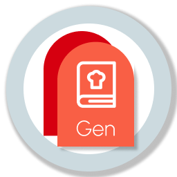
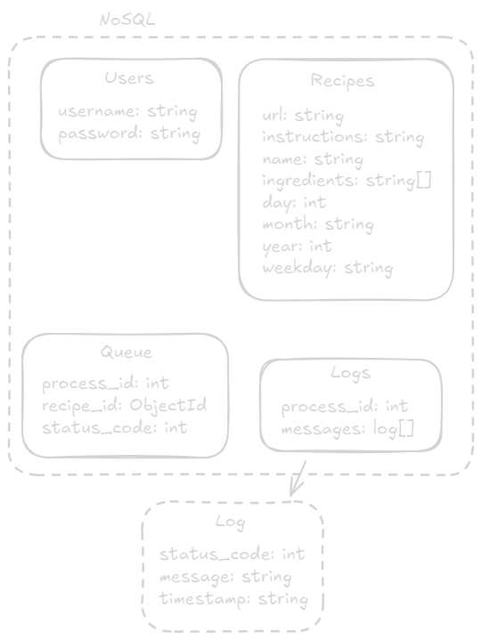

<!-- PROJECT LOGO -->
<br />
<div align="center">
  
  <p style='font-size: 20px;color:#ffe921;text-shadow: 0px 0px 6px #000000;'><b>
  Caution: This is <u>not</u> finished project <br>
  <span style='font-size:14px'><i>
  ...or a documentation in fact
  </i><span>
  </b></p>
  

  <br/><br/>

  <a href="https://github.com/reecion">
    
  </a>

  <h3 align="center">PDFs Generator</h3>

  <p align="center">
    PDFs generation Electron app with distributed backend using FastApi.
  </p>

  <h3 align="center">Tech Stack</h3>

  [![Python][Python]][Python-url] 
[![React][React.js]][React-url] 
[![Docker][Docker]][Docker-url] 
[![Kubernetes][Kubernetes]][Kubernetes-url] 
[![FastAPI][FastAPI]][FastAPI-url]
</div>

<!-- GETTING STARTED -->
## 📝 Important

**This project in not completed.**

If i remember correctly:
- Electron app code should be completed.

- Worker server code should be completed (although not the best if i look at it in the retrospective).

- Main server code is almost done, but it requires the a code for managing worker servers pods using Kubernetes (MiniKube).

<!-- ABOUT THE PROJECT -->
## 🚀 About The Project

The main goal was to build a full-stack application with distributed server architecture on a backend with containerization, orchestration and asynchronous processing to showcase my current skills in designing and implementing them.
<br/><br/>
The example I've built is an Electron app in which you can select the time span from which to generate PDFs, each having an recipe read from MongoDB database with collection of german cuisine recipes from Kaggle.

<b>Requirements:</b>
<br/>
* <b>Good-looking frontend</b> - Designed in Figma
<br/>
* <b>Simulate process intensive task</b> - Generating a lot of PDFs
<br/>
* <b>Allow for horizonal scaling</b> - Creating more PDF generation workers
<br/>
* <b>Use of asynchronous programming</b> - Workers perform the PDF generation parallelly
<br/>
* <b>Simulate a highly distributed system</b> - Using MiniKube to simulate Kubernetes environment.
<br/>
* <b>Good documentation</b>

<p align="right">(<a href="#readme-top">back to top</a>)</p>


### Installation

Not completed section

<!-- _You need to install all of the following in order to have full functionality:_

<hr />

#### 1. Create Mongo database

  * Create `mongodb` container in Docker
    ```Docker
    npm run dev
    ```

<br/>

<hr />

#### 2. Install Main API Server

  * Get Docker `server_image` form [here](https://example.com)
    
  * Create `server_image` container in your Docker
    ```Docker
    docker run -p<>:<> --network=mongodb_netowrk
    ```

<br/><br/>

<hr />

#### 3. Install Worker server

  * <b>[ Option 1 ]</b>: Get Docker `worker_image` form [here](https://example.com)
    
  * Create `worker_image` container in your Docker
    ```Docker
    docker run -p<>:<>
    ```
  * _[ Alternative method ] - Clone source code from [here](https://example.com) and run in your IDE. You will have to set some environmental variables and adjust the IP addresses._
<br/>

<p align="right">(<a href="#readme-top">back to top</a>)</p>

<hr />

#### 4. Install Electron app

  * <b>[ Option 1 ]</b>: Get built `.exe` Electron app from [here](https://example.com) - Windows only

  * <b>[ Option 2 ]</b>: Clone `source code` Electron app from [here](https://example.com).

    Assign main server IP you will use in `server_image.tsx` and run 
    ```Docker
      npm run dev
    ```
<br/> -->

<!-- DIAGRAMS -->
## Diagrams

Not completed section
... but here is some of the diagrams it should have when it's done.

<picture>
 <source media="(prefers-color-scheme: dark)" srcset="images/database_dark.png">
 
</picture>

<p align="right">(<a href="#readme-top">back to top</a>)</p>


<!-- MARKDOWN LINKS & IMAGES -->

[React.js]: https://img.shields.io/badge/React-20232A?style=for-the-badge&logo=react&logoColor=61DAFB
[React-url]: https://reactjs.org/
[Python]: https://img.shields.io/badge/Python-20232A?style=for-the-badge&logo=python&logoColor=61DAFB
[Python-url]: https://reactjs.org/
[Docker]: https://img.shields.io/badge/Docker-20232A?style=for-the-badge&logo=docker&logoColor=61DAFB
[Docker-url]: https://reactjs.org/
[Kubernetes]: https://img.shields.io/badge/Kubernetes-20232A?style=for-the-badge&logo=kubernetes&logoColor=61DAFB
[Kubernetes-url]: https://reactjs.org/
[FastAPI]: https://img.shields.io/badge/FastAPI-20232A?style=for-the-badge&logo=fastapi&logoColor=61DAFB
[FastAPI-url]: https://reactjs.org/
